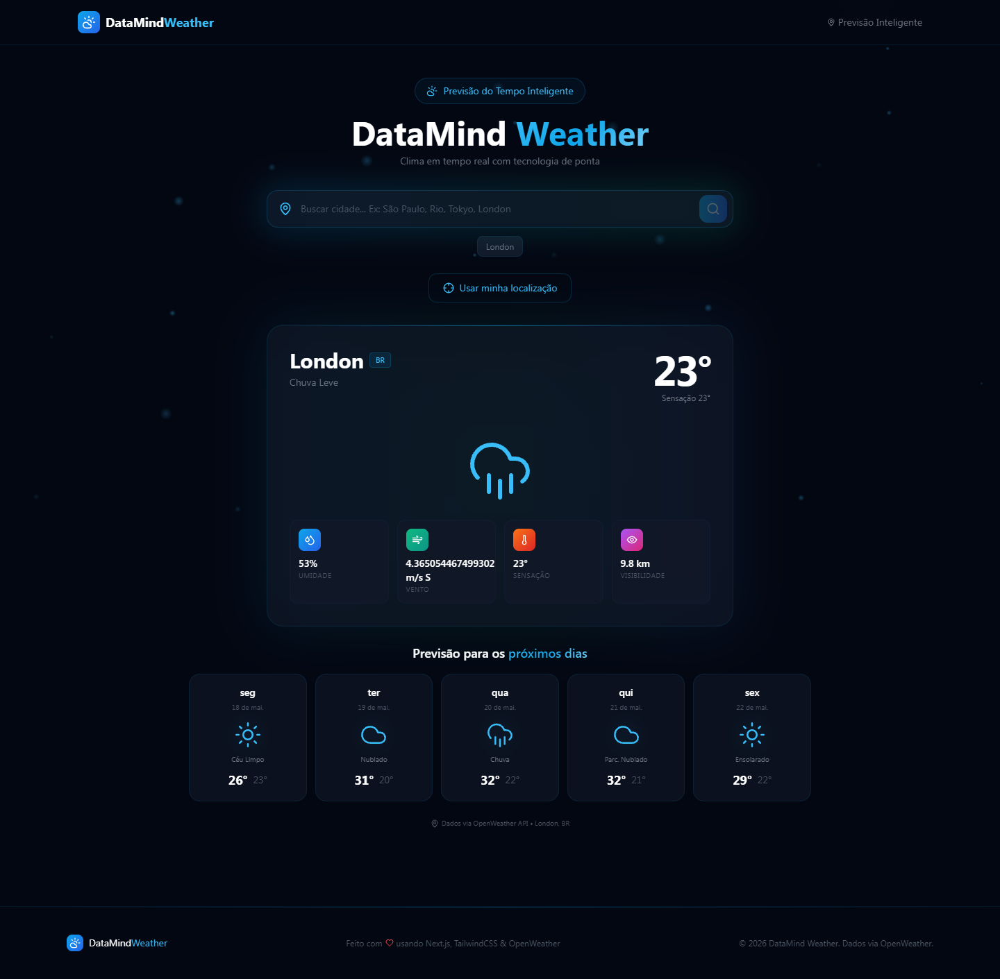
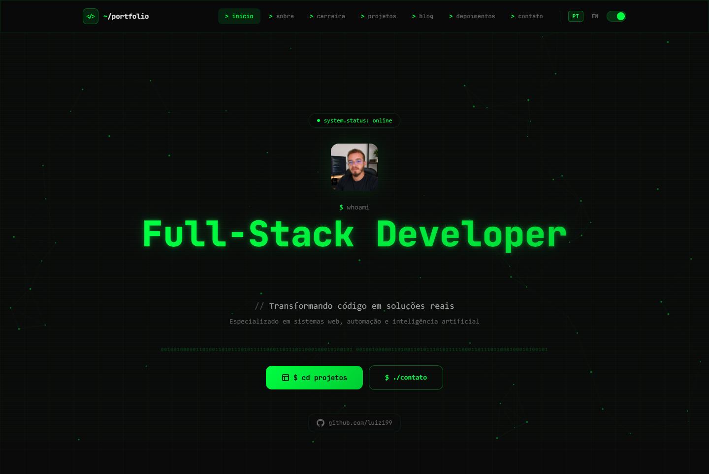
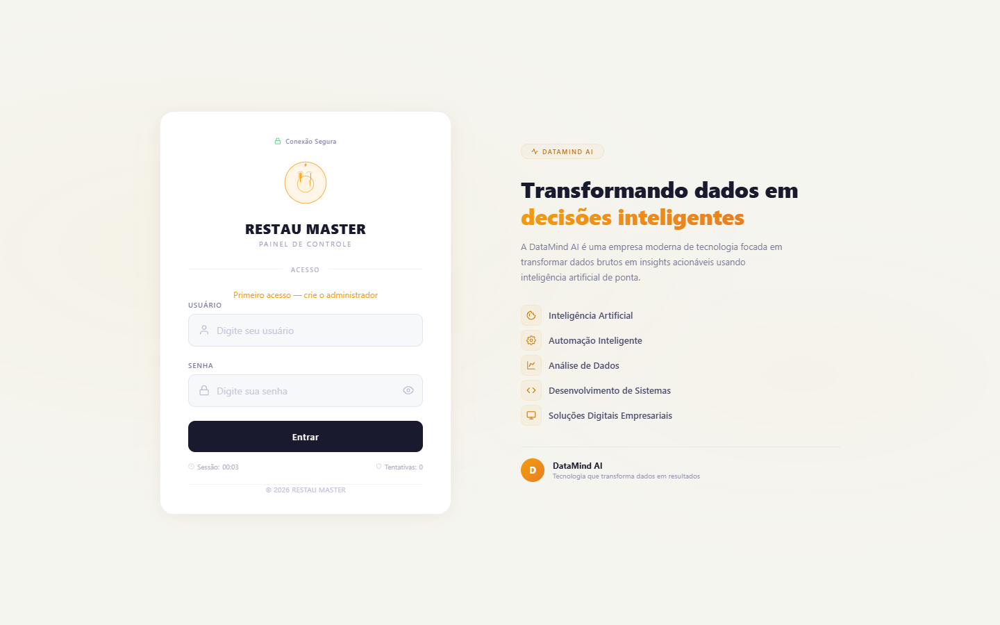
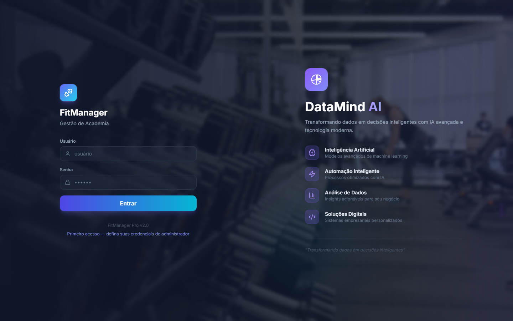
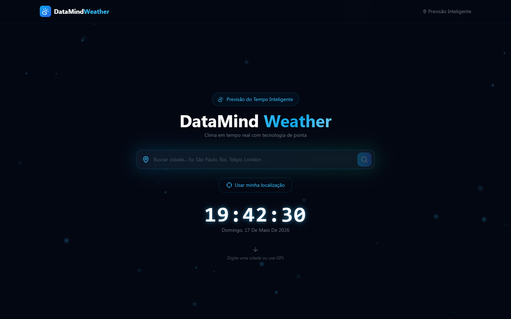
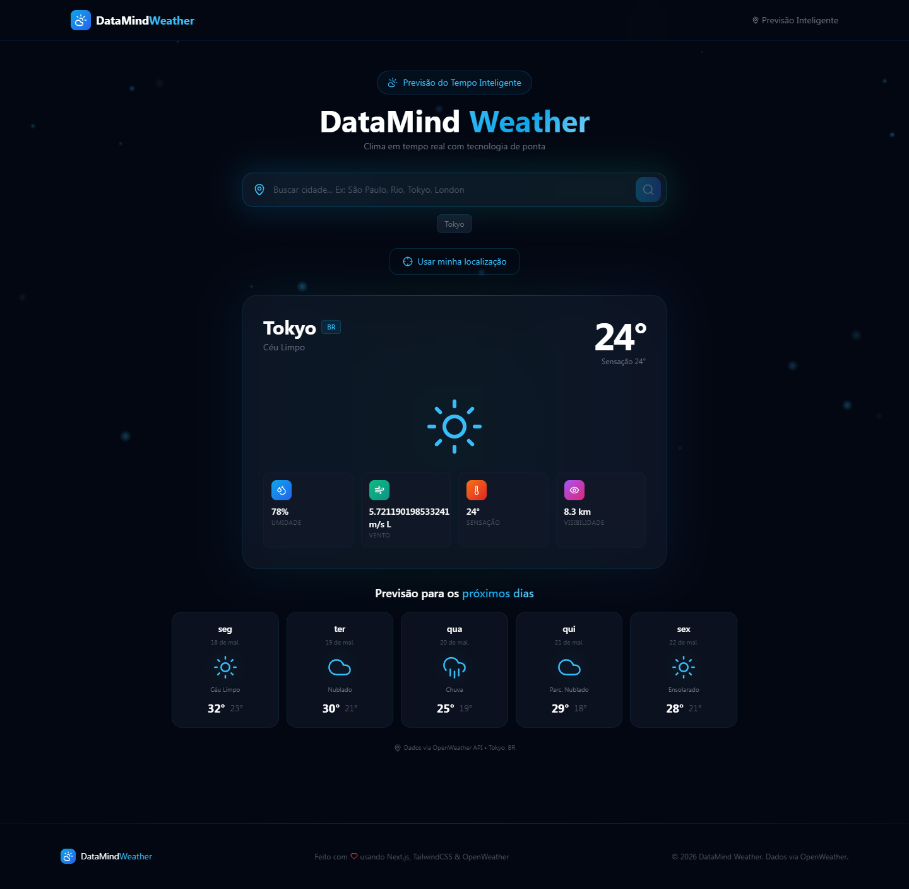
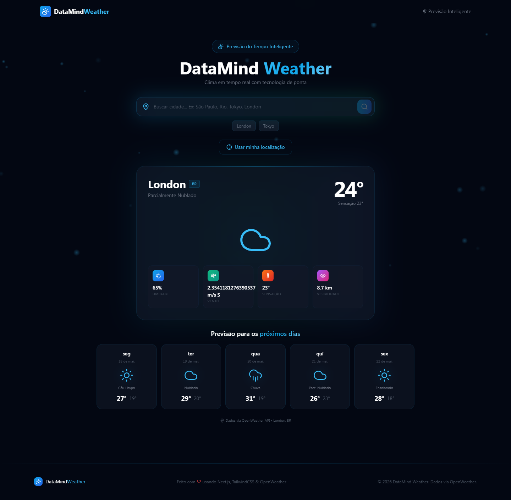

<div align="center">
  
  <br/><br/>
  <p>
    <strong>Professional Systems</strong> — Complete project portfolio by <a href="https://github.com/luiz199">Luiz Henrique</a>
  </p>
  <p>
    Full-stack developer specialized in web systems, automation, artificial intelligence, and modern SaaS applications.
  </p>
  <br/>
  <p>
    <a href="https://luiz199.github.io/professional-systems/portfolio/">
      
    </a>
    <a href="https://github.com/luiz199">
      
    </a>
    <a href="mailto:contato@datamind.ai">
      
    </a>
  </p>
</div>

---

## 📋 Projects Overview

| # | Project | Type | Stack | Live |
|---|---------|------|-------|------|
| 1 | **DataMind Weather** | Next.js App | Next.js, TypeScript, TailwindCSS, Framer Motion, OpenWeather | [Repo](https://github.com/luiz199/datamind-weather) |
| 2 | **DataMind AI** | SaaS Platform | Next.js, OpenAI, TailwindCSS, Framer Motion | [View](https://github.com/luiz199/professional-systems/tree/master/datamind-ai) |
| 3 | **Portfolio CS** | Portfolio | Alpine.js, TailwindCSS, Canvas API, PWA | [Live](https://luiz199.github.io/professional-systems/portfolio/) |
| 4 | **RESTAU MASTER PRO** | Management System | HTML5, JavaScript, LocalStorage | [View](https://github.com/luiz199/professional-systems/tree/master/restau-master-pro) |
| 5 | **FitManager Pro** | Management System | Alpine.js, TailwindCSS, Lucide | [View](https://github.com/luiz199/professional-systems/tree/master/fitmanager-pro) |
| 6 | **OpenClaw** | Game | Java | [View](https://github.com/luiz199/professional-systems/tree/master/openclaw) |
| 7 | **Avatar World** | Game | Java | [View](https://github.com/luiz199/professional-systems/tree/master/avatarworld) |

---

## 🌦️ Featured: DataMind Weather

> Real-time weather application with 5-day forecast, GPS detection, and futuristic neon design.

<p align="center">
  
</p>

**Stack:** Next.js 14 · TypeScript · TailwindCSS · Framer Motion · OpenWeather API  
**Highlights:** City search with history · GPS geolocation · Live clock · Particle background · Glassmorphism neon design  
**Repository:** [github.com/luiz199/datamind-weather](https://github.com/luiz199/datamind-weather)

---

## 🧠 DataMind AI

> AI-powered SaaS platform with intelligent chatbot (OpenAI GPT integration).

<p align="center">
  
</p>

**Stack:** Next.js 14 · OpenAI API · TailwindCSS · Framer Motion  
**Highlights:** Chat IA em tempo real · Seção de serviços · Planos de assinatura · Dashboard admin · Design NVIDIA-style  
**Repository:** [View source](https://github.com/luiz199/professional-systems/tree/master/datamind-ai)

---

## 💻 Portfolio CS

> Professional terminal-themed portfolio with particle network animation and bilingual support.

<p align="center">
  
</p>

**Stack:** Alpine.js · TailwindCSS · Canvas API · PWA  
**Highlights:** Terminal-style UI · Particle animation · i18n (PT/EN) · Dark/Light theme · Service Worker  
**Live:** [luiz199.github.io/professional-systems/portfolio/](https://luiz199.github.io/professional-systems/portfolio/)

---

## 🍽️ RESTAU MASTER PRO

> Complete restaurant management system with visual floor plan and digital ordering.

<p align="center">
  
</p>

**Stack:** HTML5 · JavaScript · LocalStorage · CSS3  
**Highlights:** Visual table map · Digital ordering · Payment processing (PIX/Cash/Credit) · Admin panel · Audit logging  
**Feature:** 100% single-file, zero dependencies

---

## 💪 FitManager Pro

> Professional gym management system with financial control and virtual turnstile.

<p align="center">
  
</p>

**Stack:** Alpine.js · TailwindCSS · Lucide Icons  
**Highlights:** Student CRUD · Financial dashboard · Training sheets (A/B/C) · CPF turnstile · Delinquency alerts  
**Feature:** 5 pre-loaded sample students, glassmorphism design

---

## 🛠️ Technology Stack

<p align="center">
  
</p>
<p align="center">
  
  
  
  
  
  
  
  
</p>

<p align="center">
  
</p>
<p align="center">
  
  
  
  
  
  
</p>

<p align="center">
  
</p>
<p align="center">
  
  
  
  
  
  
</p>

---

## 📸 Screenshots Gallery

All screenshots were captured in real browsers using **Puppeteer** and represent actual running applications.

| Project | Screenshot |
|---------|-----------|
| DataMind Weather |  |
| DataMind Tokyo |  |
| DataMind London |  |

---

## 📂 Repository Structure

```
/
├── datamind-weather/     # Next.js weather forecast app (separate repo)
├── datamind-ai/          # SaaS AI platform (single-file)
├── portfolio/            # CS-themed portfolio with PWA
├── restau-master-pro/    # Restaurant management system
├── fitmanager-pro/       # Gym management system
├── openclaw/             # Java game project
├── avatarworld/          # Java game project
├── assets/               # Shared images and resources
└── index.html            # Navigation hub
```

---

## 🚀 Quick Start

```bash
# Clone the repository
git clone https://github.com/luiz199/professional-systems.git
cd professional-systems

# Open any project directly in browser
# Example: RESTAU MASTER PRO
start restau-master-pro/index.html

# Or open the portfolio
start portfolio/index.html
```

---

## 📄 License

MIT License — see [LICENSE](LICENSE).

---

<div align="center">
  <sub>Built with ❤️ by <strong>Luiz Henrique</strong></sub>
  <br/>
  <sub>© 2026 DataMind — Inteligência • Inovação • Impacto</sub>
  <br/><br/>
  
</div>
