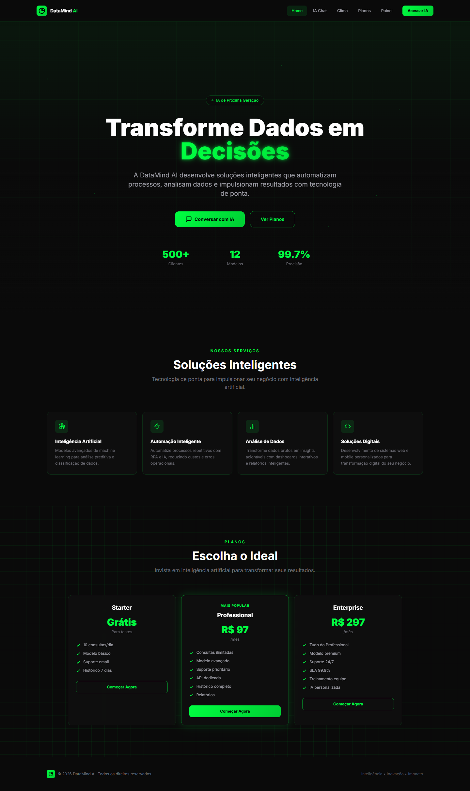

<div align="center">
  <br/>
  <a href="https://github.com/luiz199/professional-systems/tree/master/datamind-ai">
    
  </a>
  <br/>
  <br/>

  <p align="center">
    <strong>🧠 AI-Powered SaaS Platform</strong>
    <br/>
    Intelligent chatbot · Real-time weather · Premium design
  </p>

  <br/>

  <div>
    
    
    
    
    
    
  </div>

  <div>
    
    
    
  </div>

  <br/>
  <br/>
</div>

---

## 📋 Overview

**DataMind AI** is a premium SaaS landing page with integrated artificial intelligence chatbot and real-time weather forecast. Built as a single HTML file with Tailwind CSS, Alpine.js, and Lucide Icons. Features a futuristic black/neon green design inspired by NVIDIA's aesthetic.

### ✨ Key Features

| Module | Description |
|--------|-------------|
| 🏠 **Animated Hero** | Floating particles, grid background, typing effects |
| 🤖 **AI Chat** | Two modes: Ollama local (LLM) or built-in NLP fallback |
| 🌤️ **Weather** | 5-day forecast via Open-Meteo API (free, no key needed) |
| 💲 **Pricing** | 3 plans: Free, Professional R$97/mo, Enterprise R$297/mo |
| 🛠️ **Services** | 4 cards: AI, Automation, Data Analysis, Digital Solutions |
| 🔐 **Admin Panel** | Protected dashboard with login (any email/password) |
| 📱 **Responsive** | Mobile-first design with hamburger menu |

---

## 🖼️ Screenshot

<p align="center">
  
</p>

---

## 🤖 AI Chat — Two Modes

| Mode | How it Works |
|------|-------------|
| **Ollama Local** | Connects to `localhost:11434`. Requires Ollama installed + model pulled |
| **NLP Fallback** | Portuguese keyword-based NLP. Works offline, no dependencies |

> Status indicator in chat header: 🟢 green = Ollama connected, ⚫ gray = local fallback

---

## 🌤️ Weather

- **API:** [Open-Meteo](https://open-meteo.com/) — completely free, no API key
- **Geocoding:** Automatic city name search
- **Forecast:** 5 days with temperature, humidity, wind, UV index
- **Suggestions:** Quick-select for popular cities

---

## 📂 Structure

```
datamind-ai/
├── index.html       # Complete application (single-file)
├── README.md        # This file
└── screenshots/     # Project screenshots
```

---

## 🚀 Quick Start

```bash
# Open directly in browser
start datamind-ai/index.html

# For Ollama integration:
# 1. Install Ollama: https://ollama.ai
# 2. Pull a model: ollama pull llama3.2
# 3. Keep Ollama running in background
# 4. Refresh the page — chat connects automatically
```

> **Note:** All features work immediately in fallback mode without any setup.

---

## 🛠️ Tech Stack

| Technology | Purpose |
|------------|---------|
| HTML5 | Structure & semantics |
| Tailwind CSS 3.4 | Styling via CDN |
| Alpine.js 3.x | State management & interactivity |
| Lucide Icons | Professional icon set |
| Open-Meteo API | Free weather data |
| Ollama API | Local LLM integration |

---

## 📄 License

MIT License — see [LICENSE](../LICENSE).

---

<div align="center">
  <sub>Built with ❤️ by <a href="https://github.com/luiz199">Luiz Henrique</a></sub>
  <br/>
  <sub>© 2026 DataMind — Inteligência • Inovação • Impacto</sub>
</div>
