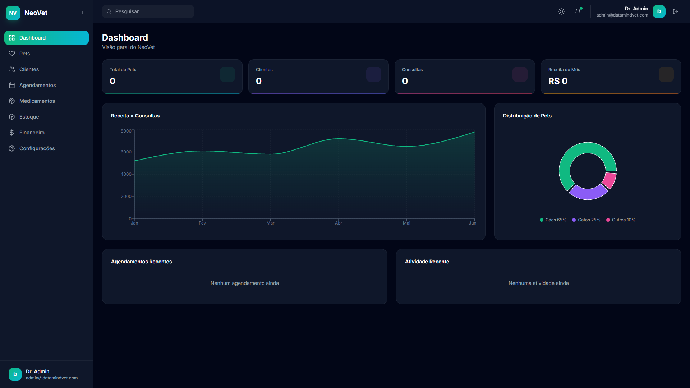
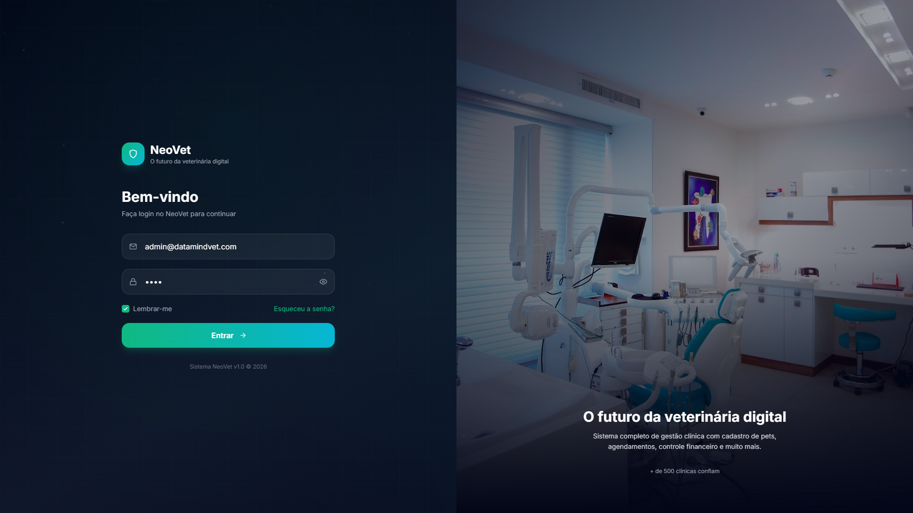
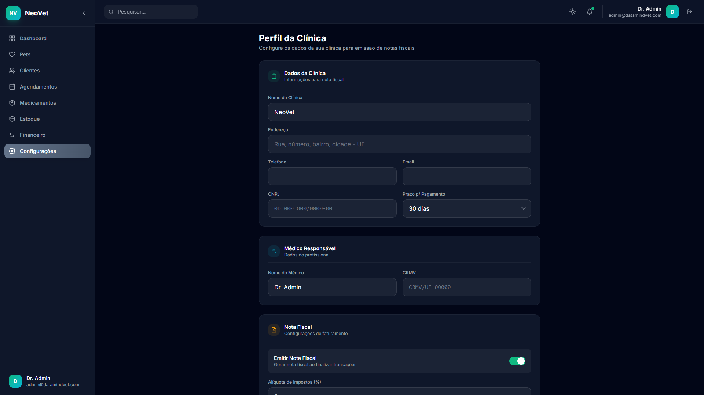

<p align="center">
  <picture>
    <source media="(prefers-color-scheme: dark)" srcset="https://readme-typing-svg.herokuapp.com?font=Fira+Code&weight=700&size=28&duration=3000&pause=500&color=10B981&center=true&vCenter=true&width=500&lines=NeoVet;O+futuro+da+veterin%C3%A1ria+digital;Veterinary+Clinic+Management;Next.js+%7C+TailwindCSS+%7C+Framer+Motion">
    
  </picture>
</p>

<p align="center">
  
  
  
  
</p>

<p align="center">
  
</p>

---

## 📋 Índice

- [Sobre o Projeto](#-sobre-o-projeto)
- [Funcionalidades](#-funcionalidades)
- [Tecnologias](#-tecnologias)
- [Pré-requisitos](#-pré-requisitos)
- [Instalação](#-instalação)
- [Como Usar](#-como-usar)
- [Estrutura do Projeto](#-estrutura-do-projeto)
- [Telas do Sistema](#-telas-do-sistema)
- [Funcionalidades Detalhadas](#-funcionalidades-detalhadas)
- [Roadmap](#-roadmap)
- [Contribuição](#-contribuição)
- [Licença](#-licença)
- [Contato](#-contato)

---

## 💡 Sobre o Projeto

**NeoVet** é um sistema completo de gestão clínica veterinária desenvolvido com Next.js 14, TailwindCSS e Framer Motion. Com design premium estilo SaaS, o NeoVet oferece uma experiência moderna e intuitiva para clínicas veterinárias de todos os portes.

> "O futuro da veterinária digital" — Sistema profissional com dashboard analítico, CRUD completo, controle financeiro com emissão de nota fiscal e muito mais.

### 🎯 Objetivo

Fornecer uma plataforma completa e profissional para clínicas veterinárias gerenciarem seus pacientes, clientes, agendamentos, estoque e finanças em um único lugar, com uma interface moderna e responsiva.

---

## ✨ Funcionalidades

### 🔐 Autenticação
- Tela de login animada com imagem real de veterinária
- Sistema de recuperação de senha
- Sessão persistente com localStorage
- Tema escuro/claro premium

### 📊 Dashboard
- Cards com estatísticas em tempo real (pets, clientes, consultas, receita)
- Gráfico de área: Receita × Consultas
- Gráfico de pizza: Distribuição de espécies
- Lista de agendamentos recentes
- Feed de atividade em tempo real

### 🐾 Cadastro de Pets
- Nome, espécie, raça, peso, idade
- Tutor responsável vinculado
- Vacinas e histórico médico
- Ícones por espécie

### 👥 Gestão de Clientes
- Cadastro completo com nome, email, telefone, endereço
- Vínculo com pets
- Pesquisa rápida

### 📅 Agendamentos
- Tipos: Consulta, Vacina, Cirurgia, Banho e Tosa, Exame
- Status: Agendado, Confirmado, Em andamento, Concluído, Cancelado
- Data e hora
- Ordenação por data

### 💊 Medicamentos
- Cadastro com dosagem, fabricante, quantidade
- Controle de validade
- Categorias

### 📦 Estoque Inteligente
- Controle de quantidade com alerta de estoque mínimo
- Destaque visual em vermelho para itens críticos
- Fornecedor e observações

### 💰 Financeiro
- Entradas e saídas
- Categorias por serviço
- Formas de pagamento (Dinheiro, Cartão, Pix, Boleto)
- Saldo atualizado em tempo real
- **Emissão de Nota Fiscal** com CNPJ e cálculo de impostos

### ⚙️ Perfil da Clínica
- Nome, endereço, telefone, email
- CNPJ para nota fiscal
- Nome do médico responsável e CRMV
- Prazo de pagamento
- Alíquota de impostos
- Toggle para emissão de notas fiscais

---

## 🛠️ Tecnologias

| Categoria | Tecnologias |
|-----------|-------------|
| **Framework** | Next.js 14 |
| **Linguagem** | JavaScript (ES6+) |
| **Estilização** | TailwindCSS |
| **Animações** | Framer Motion |
| **Gráficos** | Recharts |
| **Ícones** | React Icons (Feather) |
| **Notificações** | React Hot Toast |
| **Armazenamento** | localStorage |
| **Nota Fiscal** | geração HTML dinâmica |

---

## 📋 Pré-requisitos

- Node.js 18+ 
- npm ou yarn
- Navegador moderno (Chrome, Firefox, Edge, Safari)

---

## 🚀 Instalação

```bash
# Clone o repositório
git clone https://github.com/luiz199/professional-systems.git

# Acesse a pasta do projeto
cd professional-systems/neovet

# Instale as dependências
npm install

# Inicie o servidor de desenvolvimento
npm run dev
```

Acesse [http://localhost:3000](http://localhost:3000) no seu navegador.

---

## 🔑 Como Usar

### Login de Teste

| Campo | Valor |
|-------|-------|
| **Email** | `admin@datamindvet.com` |
| **Senha** | `2025` |

### Fluxo Básico

1. **Faça login** com as credenciais de teste
2. **Configure a clínica** em Configurações → Perfil (adicione CNPJ, médico, etc.)
3. **Cadastre clientes** em Clientes
4. **Cadastre pets** vinculados aos clientes
5. **Crie agendamentos** em Agendamentos
6. **Registre transações** financeiras
7. **Emita notas fiscais** clicando no ícone de documento ao lado de cada transação

---

## 📁 Estrutura do Projeto

```
neovet/
├── public/                          # Arquivos estáticos
├── src/
│   ├── components/
│   │   └── Layout.js               # Sidebar + Navbar principal
│   ├── context/
│   │   ├── AuthContext.js           # Contexto de autenticação
│   │   └── ThemeContext.js          # Contexto de tema (dark/light)
│   ├── data/
│   │   └── store.js                 # Camada de dados (localStorage)
│   ├── pages/
│   │   ├── _app.js                  # App wrapper (providers)
│   │   ├── _document.js             # Document HTML
│   │   ├── index.js                 # Tela de login
│   │   └── dashboard/
│   │       ├── index.js             # Dashboard principal
│   │       ├── clients.js           # CRUD Clientes
│   │       ├── pets.js              # CRUD Pets
│   │       ├── appointments.js      # Agendamentos
│   │       ├── medications.js       # Medicamentos
│   │       ├── inventory.js         # Estoque
│   │       ├── financial.js         # Financeiro + Nota Fiscal
│   │       └── profile.js           # Perfil da clínica
│   └── styles/
│       └── globals.css              # Estilos globais
├── package.json
├── tailwind.config.js
├── next.config.js
└── README.md
```

---

## 🖥️ Telas do Sistema

### Tela de Login
<p align="center">
  
</p>

### Dashboard
<p align="center">
  
</p>

### Perfil da Clínica
<p align="center">
  
</p>

---

## 📌 Funcionalidades Detalhadas

### 🔐 Sistema de Autenticação
- Login com validação de email e senha
- Recuperação de senha (interface)
- Sessão persistente via localStorage
- Proteção de rotas (redirect automático)
- Loading spinner durante verificação

### 📊 Dashboard Analítico
- 4 cards de estatísticas: Pets, Clientes, Consultas, Receita do mês
- Gráfico de área com receita mensal
- Gráfico de linha com número de consultas
- Gráfico de pizza com distribuição de espécies
- Lista de agendamentos recentes com status
- Feed de atividade com histórico de ações

### 🐶 Cadastro de Animais
- Informações completas: nome, espécie, raça, peso, idade
- Vínculo com tutor (cliente)
- Vacinas e histórico médico
- Ícones animados por espécie

### 💰 Módulo Financeiro
- Registro de entradas e saídas
- Categorias específicas para veterinária
- Múltiplas formas de pagamento
- Cálculo automático de saldo
- Emissão de nota fiscal em janela separada
- Nota fiscal com: logo, dados da clínica, CNPJ, CRMV, impostos

### 📦 Controle de Estoque
- Cadastro de itens com quantidade
- Estoque mínimo configurável
- Alerta visual para itens abaixo do mínimo
- Categorias: Medicamento, Vacina, Material, Equipamento, Higiene

---

## 🗺️ Roadmap

- [x] Autenticação e dashboard
- [x] CRUD de clientes e pets
- [x] Sistema de agendamentos
- [x] Controle de medicamentos
- [x] Gestão de estoque com alertas
- [x] Módulo financeiro completo
- [x] Emissão de nota fiscal
- [x] Perfil da clínica com CNPJ
- [ ] Integração com banco de dados (MongoDB)
- [ ] API REST com autenticação JWT
- [ ] Upload de fotos dos pets
- [ ] Relatórios em PDF
- [ ] Modo claro (tema light)
- [ ] Notificações push
- [ ] Integração com WhatsApp
- [ ] Aplicativo mobile (React Native)

---

## 🤝 Contribuição

Contribuições são bem-vindas! Siga os passos abaixo:

1. Faça um fork do projeto
2. Crie uma branch para sua feature (`git checkout -b feature/AmazingFeature`)
3. Commit suas mudanças (`git commit -m 'Add: nova funcionalidade'`)
4. Push para a branch (`git push origin feature/AmazingFeature`)
5. Abra um Pull Request

---

## 📄 Licença

Distribuído sob a licença MIT. Veja `LICENSE` para mais informações.

---

## 📬 Contato

**Luiz Henrique** — Full-Stack Developer

<p align="center">
  <a href="https://luiz199.github.io/professional-systems/portfolio/">
    
  </a>
  <a href="https://github.com/luiz199">
    
  </a>
  <a href="mailto:admin@datamindvet.com">
    
  </a>
</p>

---

<p align="center">
  
</p>
